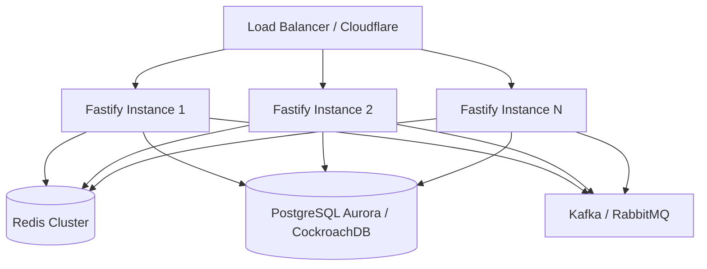

# Scale Plan (10,000+ RPS Production Architecture)

## Architecture

- **API Layer:** Horizontally scaled Fastify (Node.js) instances running inside containerized environments (Kubernetes/EKS). Fastify's light overhead and quick event loop handles high-throughput HTTP connections efficiently.
- **Database Layer:** Distributed relational database (e.g., Amazon Aurora PostgreSQL or CockroachDB) supporting read replicas and multi-master options to scale both read and write operations.
- **Cache Layer:** Multi-node Redis Cluster configured with high availability (replication + Sentinel) to handle high-speed rate-limiting and temporary idempotency key states.
- **Queue Layer:** Message broker (e.g., Apache Kafka or RabbitMQ) to decouple heavy downstream processing from the ingestion endpoint. Signals are validated and quickly written to Kafka for asynchronous worker consumption.

---

## Rate Limiting (Redis-Based)

- **Strategy:** Redis Sliding Window Counter or Token Bucket using atomic `EVALSHA` scripts to perform check-and-consume in a single network roundtrip.
- **Key Design:** `rl:{userId}:{window_timestamp_minute}` or `rl:{userId}` for a token bucket model.
- **Expiration Strategy:** 
  - Token bucket key expires after `WINDOW_MS / 1000` seconds of inactivity.
  - Sliding window logs expire automatically via TTL set to `WINDOW_MS + JITTER`.
- **Parallel Requests:** Handled atomically in Redis via Lua scripts, completely avoiding race conditions between parallel HTTP requests.

---

## Idempotency Store

- **Storage Model:** Dual-tier storage.
  1. **Hot Tier:** Redis cache storing active `Idempotency-Key` mapping to the response payload of completed signals (or a `processing` lock status).
  2. **Cold Tier:** The primary database (`signals` table) acts as the source of truth, leveraging a `UNIQUE` constraint on the `idempotency_key` column.
- **Indexes:** Unique index on `idempotency_key` (B-Tree).
- **TTL Strategy:** Idempotency keys are cached in Redis for 24-48 hours. Database records are kept permanently or archived after 90 days.
- **Cleanup Strategy:** Auto-eviction in Redis via TTL. Database historical archiving run asynchronously during off-peak hours using partitioned tables.

---

## Database Optimization

- **Indexes:**
  - Unique index: `idx_signals_idem` on `idempotency_key`.
  - Composite index: `idx_signals_user_created` on `(user_id, created_at DESC)`.
- **Partitioning:** Table partitioning by range on `created_at` (e.g., monthly partitions) to make historical cleanups instant (`DROP PARTITION`) without blocking active writes.
- **Connection Pooling:** Use connection poolers like PgBouncer in transaction mode to efficiently manage thousands of concurrent database connections from horizontally scaled API instances.

---

## Reliability & Fault Tolerance

- **Retries:** Clients retrying failed requests must provide the same `Idempotency-Key` to avoid double-processing. 
- **Observability:**
  - **Metrics:** Prometheus metrics tracking HTTP request rates, latency (p95, p99), error rates (5xx), rate limit hit rate, and DB connection pool usage.
  - **Tracing:** OpenTelemetry instrumentation for end-to-end tracing across API instances, cache nodes, and DB.
  - **Logs:** Structured JSON logging (pino/fastify-logger) shipped to Elasticsearch/Datadog.

---

## Deployment & Infrastructure

- **Autoscaling:** Horizontal Pod Autoscaler (HPA) in Kubernetes scaling pods based on CPU utilization and incoming request concurrency.
- **Rolling Deploys:** Zero-downtime rolling updates with readiness/liveness probes ensuring traffic only routes to healthy instances.
- **Multi-Region:** Geo-DNS routing requests to the closest regional API deployments. Multi-region database replication (e.g. Aurora Global Database) ensures data consistency and fast local reads.
